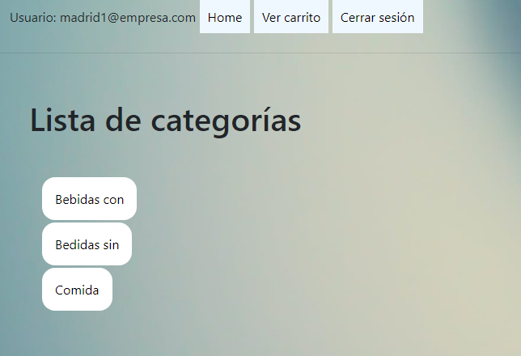
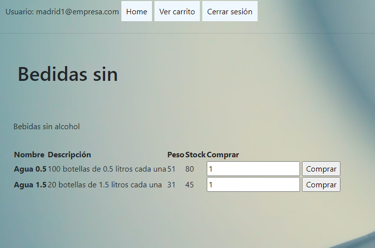
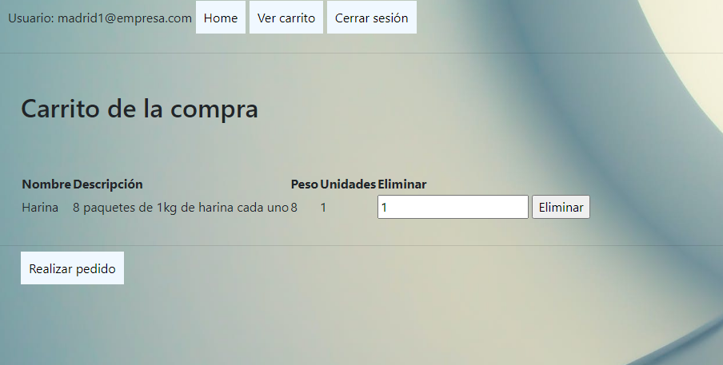
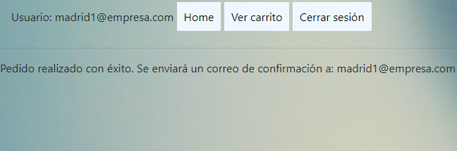

# Pedidos-php

Velaquí unha páxina para controlar os pedidos de comida que te fai a xente. Consta dun login, dunha páxina de compra con carrito e dunha parte de pedidos para confirmar mediante o envío de un correo qué productos desexas comprar.

## Login

O login atópase en login.php e é sinxelo: 2 inputs cos seus correspondentes label de usuario e clave, que validan e deixan pasar ao resto da web só aos dous correos e claves que temos grabados na base de datos. Se se intenta aterrizar en calquera outro sitio, o PHP rediríxete ao login.

## Home

A páxina principal permite elexir entre 3 tipos de suministros: bebidas con alcohol, bebidas sen alcohol e comida. Tamén permite sair da sesión e ver o carrito, aínda que iso é parte da cabeceira común con todas as partes da páxina.



Os enlaces foron alongados para que foran máis clicables e ordenáronse un pouco os elementos en liña.

## As páxinas de productos

Dentro de productos.php chegámos a cada un dos productos individuais sacando a categoría correspondente da base de datos e imprimindoa nunha tabla en pantalla:

```php
$cat = cargar_categoria($_GET['categoria']);
    $productos = cargar_productos_categoria($_GET['categoria']);
    if($cat=== FALSE or $productos === FALSE){
        echo "<p class='error'>Error al conectar con la base de datos</p>";
        exit;
    }
```



## Carrito

As compras que se fan na sección de productos grábanse no carrito, onde podemos finalizar o pedido e mandar ese correo confirmando o que compramos.



Premendo no botón poñemos en marcha a función enviarCorrreo() e nos aparece a seguinte mensaxe confirmando que efectivamente o pedido queda feito.


